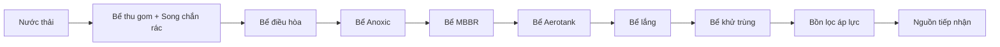

# Dịch vụ xử lý nước thải trọn gói

> Giải pháp tổng thể dành cho doanh nghiệp, triển khai đồng bộ từ khảo sát, tư vấn, thiết kế, thi công, lắp đặt đến vận hành hệ thống xử lý nước thải; hướng đến tối ưu chi phí, hỗ trợ tuân thủ yêu cầu môi trường và duy trì hiệu quả vận hành ổn định.

## Nội dung

- [1. Xử lý nước thải trọn gói là gì?](#1-xu-ly-nuoc-thai-tron-goi-la-gi)
- [2. Lợi ích khi lựa chọn dịch vụ trọn gói](#2-loi-ich-khi-lua-chon-dich-vu-tron-goi)
- [3. Đối tượng doanh nghiệp phù hợp](#3-doi-tuong-doanh-nghiep-phu-hop)
- [4. Quy trình triển khai tại Hợp Nhất](#4-quy-trinh-trien-khai-tai-hop-nhat)
- [5. Sơ đồ công nghệ xử lý nước thải tham khảo](#5-so-do-cong-nghe-xu-ly-nuoc-thai-tham-khao)
- [6. Thi công và lắp đặt hệ thống](#6-thi-cong-va-lap-dat-he-thong)
- [7. Vận hành, bàn giao và hỗ trợ kỹ thuật](#7-van-hanh-ban-giao-va-ho-tro-ky-thuat)
- [8. Vì sao doanh nghiệp lựa chọn Hợp Nhất?](#8-vi-sao-doanh-nghiep-lua-chon-hop-nhat)
- [9. Cam kết dịch vụ](#9-cam-ket-dich-vu)
- [10. Liên hệ](#10-lien-he)

---

## 1. Xử lý nước thải trọn gói là gì?

Xử lý nước thải trọn gói là giải pháp tổng thể bao gồm toàn bộ các công đoạn từ khảo sát, tư vấn, thiết kế đến thi công, lắp đặt và vận hành hệ thống xử lý nước thải. Mô hình này giúp doanh nghiệp tiết kiệm thời gian, tối ưu chi phí và đảm bảo hệ thống hoạt động theo yêu cầu môi trường.

Khi sử dụng dịch vụ trọn gói, doanh nghiệp chỉ cần làm việc với một đơn vị cung cấp duy nhất. Các nội dung liên quan đến kỹ thuật, công nghệ và hồ sơ môi trường được triển khai đồng bộ, qua đó hỗ trợ quá trình vận hành thuận lợi và hiệu quả hơn.

## 2. Lợi ích khi lựa chọn dịch vụ trọn gói

Việc triển khai theo mô hình trọn gói mang lại nhiều lợi ích rõ ràng cho doanh nghiệp:

- Đồng bộ giải pháp từ đầu đến cuối, hạn chế sai lệch giữa thiết kế và thi công.
- Tiết kiệm thời gian làm việc với nhiều nhà thầu khác nhau.
- Hỗ trợ đảm bảo hệ thống phù hợp với hồ sơ môi trường đã được phê duyệt.
- Giảm thiểu rủi ro vận hành và các chi phí phát sinh không cần thiết.
- Có một đơn vị chịu trách nhiệm xuyên suốt quá trình triển khai.

## 3. Đối tượng doanh nghiệp phù hợp

Dịch vụ xử lý nước thải trọn gói phù hợp với nhiều nhóm khách hàng và loại hình cơ sở, tiêu biểu gồm:

- Nhà máy sản xuất công nghiệp.
- Khu công nghiệp, cụm công nghiệp.
- Cơ sở chế biến thực phẩm, thủy sản.
- Bệnh viện, phòng khám.
- Khách sạn, khu nghỉ dưỡng.

---

## 4. Quy trình triển khai tại Hợp Nhất

Để hệ thống vận hành ổn định, đạt yêu cầu xả thải và tối ưu chi phí đầu tư, Hợp Nhất triển khai dịch vụ theo quy trình có kiểm soát ở từng giai đoạn.

### 4.1. Khảo sát và tư vấn giải pháp

Đây là bước nền tảng, ảnh hưởng trực tiếp đến hiệu quả của toàn bộ hệ thống. Hợp Nhất tiến hành khảo sát thực tế, phân tích đặc tính nước thải và đề xuất phương án phù hợp dựa trên:

- Quy mô doanh nghiệp.
- Công suất xả thải.
- Ngành nghề sản xuất.
- Yêu cầu xả thải theo quy chuẩn áp dụng.

### 4.2. Thiết kế hệ thống theo hồ sơ môi trường

Sau khi thống nhất phương án, đội ngũ kỹ sư tiến hành thiết kế chi tiết hệ thống. Nội dung thiết kế tập trung vào các yêu cầu chính:

- Phù hợp với thông tin trong báo cáo ĐTM, hồ sơ đăng ký môi trường hoặc giấy phép môi trường đã được phê duyệt.
- Tính toán công suất và tải lượng ô nhiễm.
- Lựa chọn công nghệ xử lý phù hợp.
- Tối ưu diện tích và chi phí đầu tư.

## 5. Sơ đồ công nghệ xử lý nước thải tham khảo

Sơ đồ dưới đây minh họa một quy trình xử lý nước thải sinh hoạt tại khu dân cư được nêu trong tài liệu gốc.

### 5.1. Thuyết minh các công đoạn chính

| Công đoạn | Chức năng chính |
|---|---|
| **Bể thu gom + Song chắn rác** | Thu gom nước thải và loại bỏ các tạp chất thô như rác, bao nilon, cặn kích thước lớn; hỗ trợ hạn chế tắc nghẽn và bảo vệ thiết bị phía sau. |
| **Bể điều hòa** | Điều hòa lưu lượng và nồng độ ô nhiễm, hạn chế sốc tải cho các công trình sinh học; thường kết hợp sục khí hoặc khuấy trộn để ngăn lắng cặn và giảm mùi. |
| **Bể Anoxic** | Xử lý sinh học trong điều kiện thiếu khí, hỗ trợ quá trình khử Nitrat (NO₃⁻) thành khí Nitơ (N₂), qua đó góp phần loại bỏ Nitơ trong nước thải. |
| **Bể MBBR** | Sử dụng giá thể vi sinh chuyển động để tăng mật độ vi sinh vật bám dính, hỗ trợ xử lý BOD, COD và tăng khả năng chịu tải của hệ vi sinh. |
| **Bể Aerotank** | Bể sinh học hiếu khí, nơi vi sinh vật sử dụng oxy để phân hủy các chất hữu cơ còn lại; hệ thống cấp khí giúp duy trì nồng độ oxy hòa tan cần thiết. |
| **Bể lắng** | Tách bùn sinh học khỏi nước sau xử lý; một phần bùn có thể được tuần hoàn về bể sinh học, phần dư được đưa đi xử lý. |
| **Bể khử trùng** | Sử dụng hóa chất như Chlorine, Javen hoặc phương pháp phù hợp khác để xử lý vi khuẩn, vi sinh vật còn lại trước khi xả thải. |
| **Bồn lọc áp lực** | Xử lý bậc cao nhằm loại bỏ cặn lơ lửng còn sót lại, màu và một phần chất hữu cơ thông qua vật liệu lọc như cát, than hoạt tính. |

---

## 6. Thi công và lắp đặt hệ thống

Sau khi hoàn tất thiết kế, Hợp Nhất tiến hành thi công và lắp đặt hệ thống theo quy trình kỹ thuật nhằm đảm bảo chất lượng công trình và hiệu quả vận hành thực tế.

Các tiêu chí chính trong quá trình triển khai gồm:

- Lắp đặt đúng bản vẽ thiết kế.
- Sử dụng vật tư, thiết bị đạt yêu cầu.
- Kiểm soát tiến độ và chất lượng từng hạng mục.
- Đảm bảo an toàn lao động và yêu cầu môi trường trong quá trình thi công.

Việc thi công đồng bộ giúp hạn chế lỗi kỹ thuật và hỗ trợ hệ thống vận hành ổn định ngay từ giai đoạn đầu.

## 7. Vận hành, bàn giao và hỗ trợ kỹ thuật

Sau khi hoàn tất thi công, hệ thống được vận hành thử nghiệm và hiệu chỉnh trước khi bàn giao chính thức cho doanh nghiệp.

### 7.1. Vận hành thử nghiệm

Giai đoạn này tập trung kiểm tra tổng thể khả năng hoạt động của hệ thống:

- Kiểm tra lưu lượng và hiệu suất xử lý.
- Điều chỉnh các thông số kỹ thuật.
- Kiểm tra chất lượng nước đầu ra theo yêu cầu áp dụng.

### 7.2. Bàn giao hệ thống

Sau khi hệ thống đáp ứng yêu cầu, Hợp Nhất thực hiện bàn giao cho doanh nghiệp với các nội dung:

- Hướng dẫn vận hành chi tiết.
- Cung cấp tài liệu kỹ thuật.
- Đào tạo nhân sự vận hành.

### 7.3. Hỗ trợ kỹ thuật sau bàn giao

Hợp Nhất tiếp tục đồng hành cùng doanh nghiệp trong quá trình vận hành thông qua:

- Hỗ trợ xử lý sự cố.
- Bảo trì, bảo dưỡng định kỳ.
- Tư vấn nâng cấp hệ thống khi cần thiết.

---

## 8. Vì sao doanh nghiệp lựa chọn Hợp Nhất?

Hợp Nhất cung cấp [dịch vụ xử lý nước thải](https://moitruonghopnhat.com/xu-ly-nuoc-thai/) theo hướng đồng bộ từ tư vấn, thiết kế, thi công đến hỗ trợ vận hành. Theo nội dung giới thiệu của công ty, các điểm nổi bật gồm:

### Giải pháp toàn diện - một đầu mối

Doanh nghiệp không cần làm việc với nhiều bên khác nhau; các công đoạn được triển khai bởi một đơn vị xuyên suốt.

### Bám sát yêu cầu hồ sơ môi trường

Hệ thống được thiết kế và vận hành trên cơ sở hồ sơ môi trường của dự án, qua đó hỗ trợ doanh nghiệp kiểm soát rủi ro tuân thủ.

### Đội ngũ chuyên môn

Đội ngũ kỹ sư có kinh nghiệm trong lĩnh vực xử lý nước thải công nghiệp, tập trung vào tính chính xác và hiệu quả trong triển khai thực tế.

### Tối ưu chi phí đầu tư và vận hành

Giải pháp được tính toán theo điều kiện thực tế của dự án nhằm cân đối giữa hiệu quả xử lý, diện tích bố trí và chi phí đầu tư - vận hành.

## 9. Cam kết dịch vụ

Theo tài liệu giới thiệu, với hơn 15 năm kinh nghiệm trong lĩnh vực xử lý nước thải, Hợp Nhất cam kết:

- Nước thải đầu ra đạt quy chuẩn theo quy định.
- Thi công đúng tiến độ đã cam kết.
- Hỗ trợ kỹ thuật lâu dài.
- Minh bạch chi phí, hạn chế phát sinh bất hợp lý.

---

## 10. Liên hệ

Nếu doanh nghiệp có nhu cầu tư vấn, thiết kế hoặc thi công hệ thống xử lý nước thải, có thể liên hệ Hợp Nhất qua:

- **Dịch vụ:** [Xử lý nước thải trọn gói](https://moitruonghopnhat.com/dich-vu-xu-ly-nuoc-thai-tron-goi/)
- **Hotline:** [0938.857.768](tel:0938857768)
- **Email:** [congthongtin@moitruonghopnhat.com](mailto:congthongtin@moitruonghopnhat.com)
- **Website:** [moitruonghopnhat.com](https://moitruonghopnhat.com/)

